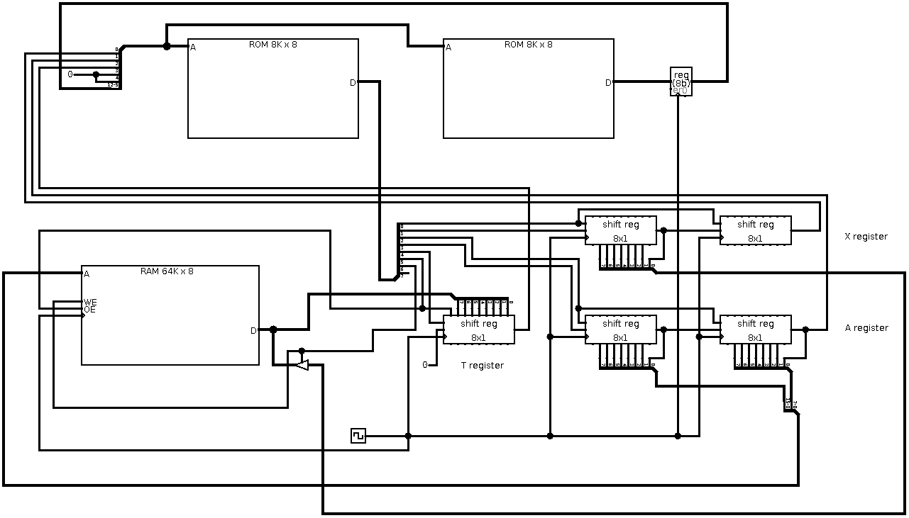

# snail
Microcoded serial CPU implemented with discrete TTL chips

The physical prototype fits on a single (large) breadboard, currently
everything is assembled except for the microcode EEPROMs.

The name is inspired by its instruction timing, which is about 100 cycles per
instruction due to its serial achitecture in combination with the fact that
the instruction pointer is stored in RAM.

## CPU design

A schematic can be found in `logisim/serial.circ`. The main design features
can be summarized as follows:
    * Serial design, all microarchitecture registers are implemented as
      shift registers
    * Microcode stored in 2 8kB EEPROMs
    * 32 registers, all stored in RAM, including instruction pointer
    * All instructions are 8-bit, and require about 100 clock cycles

The instruction set currently implemented is a simple but functional one:

    aaaaa000      [ZP] = X + [ZP] ; X = carry
    aaaaa100      X = X & [ZP]
    aaaaa010      X = X ^ [ZP]
    aaaaa110      X = [ZP]
    aaaaa001      [ZP] = X
    aaaaa101      X = [X:[ZP]]
    aaaaa011      [[ZP+1]:[ZP]] = X           (require: ZP = xxxx0)
    ----1011      PORT = X (signal: XL -> PORT), X = 2 input bits
    nnnn0111      X = (X >> 4) | nnnn0000
    aaaaa111      [ZP]:[2] -> IP   if X = 0   (require: ZP = 10xx1)

Where ZP is a ("zero-page") register, X is the accumulator which is stored in
a physical register, and `nnnn` is a 4-bit literal value. IP is stored at
address 0, LSB order. Having IP in RAM simplifies the microarchitecture
somewhat, at the expense of having to spend a large amount (both in terms of
time and storage) of microcode updating IP and loading the data where it
points to.

Since I was running out of microcode space, some of the indirect addressing
and jump instructions have constraints on which registers can be used, to
allow for microcode optimizations.

The microarchitecture has three registers: A (16-bit), X (16-bit) and T
(8-bit). Note that the CPU accumulator X is shifted around these registers,
although it is normally stored in the low byte of microregister X.

Each microinstruction consists of the following eight signals:

    0       shx     shift X register one bit (high-to-low)
    1       x       new value of high bit when X register is shifted
    2       sha     shift A register one bit (high-to-low)
    3       a       new value of high bit when A register is shifted
    4       sht     shift T register one bit (high-to-low)
    5       load    load byte at RAM address A to T: [A] -> T
    6       store   store high byte of X into RAM address at A: XH -> [A]
    7       io      store low byte of X into I/O output latch

These are stored in microcode memory A. Microcode memory B contains the next
microcode state (8-bin). Both microcode memories get the same address input:

    0       x0      bit 0 of X register
    1       a0      bit 0 of A register
    2       t0      bit 0 of T register
    3       in0     input bit 0
    4       in1     input bit 1 (these two are the only input I/O bits)
    5--12   state   current microcode state

See `ucode.py` for the implementation of the CPU instruction set.

## Simulation

A mostly complete circuit using logisim-evolution is available in
`logisim/serial.circ`. In theory you can load the microcode to the ROMs there
and simulate programs with logisim, but it is rather slow so this is not
practical beyond a few instructions.

Instead, a low-level simulator has been implemented in Python: `cpu/usim.py`

To try out a test program, first build the microcode:

    cd cpu
    python3 ucode.py

This creates two logisim-compatible files containing the microcode ROM
data: `ucode_a.hex` (microinstructions) and `ucode_b.hex` (next state table).

Now you can assemble one of the test programs:

    python3 test1.py

The file `test1.hex` now contains a RAM image. Note that the CPU keeps the
instruction pointer in RAM at address 0, so a pointer to the actual code is
included.

Now you can run this in the simulator, and get a lot of output:

    python3 usim.py test1.hex | less

The last part is a hex dump of the RAM at the end of program execution, and
this little test program computes the byte 0xDB which is stored at address
0x0A.

